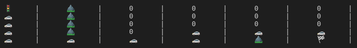

##  CppND A* Grid Search

This repository contains the code for the 'A* Grid Search' assignment which is a part of the Udacity C++ Nanodegree.

In this assignment, an [A* search algorithm](https://en.wikipedia.org/wiki/A*_search_algorithm) is used to find the shortest path from a start node (denoted by: 🚦) to an end node (denoted by: 🏁) in a given grid. The challenge for the search algorithm is to find the shortest path avoiding the obstacles (denoted by: ⛰️) present at various grid cells.

The grid cells containing 🚗 in the image below denotes the shortest path between the start node and the end node. 

## Note
[1.board](1.board) is an example grid file that the code for the search algorithm needs as an input.
